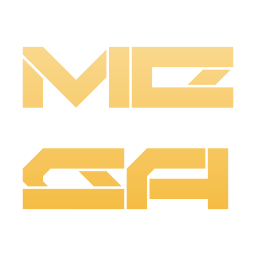

*****
MEGA
*****

.. image:: https://img.shields.io/badge/Telegram-blue?link=https://t.me/mindustryeditor&logo=data:image/svg+xml;base64,PHN2ZyB4bWxucz0iaHR0cDovL3d3dy53My5vcmcvMjAwMC9zdmciIHZpZXdCb3g9IjAgMCAyNCAyNCI+PHBhdGggZD0iTTEyIDI0YzYuNjI3IDAgMTItNS4zNzMgMTItMTJTMTguNjI3IDAgMTIgMCAwIDUuMzczIDAgMTJzNS4zNzMgMTIgMTIgMTJaIiBmaWxsPSJ1cmwoI2EpIi8+PHBhdGggZmlsbC1ydWxlPSJldmVub2RkIiBjbGlwLXJ1bGU9ImV2ZW5vZGQiIGQ9Ik01LjQyNSAxMS44NzFhNzk2LjQxNCA3OTYuNDE0IDAgMCAxIDYuOTk0LTMuMDE4YzMuMzI4LTEuMzg4IDQuMDI3LTEuNjI4IDQuNDc3LTEuNjM4LjEgMCAuMzIuMDIuNDcuMTQuMTIuMS4xNS4yMy4xNy4zMy4wMi4xLjA0LjMxLjAyLjQ3LS4xOCAxLjg5OC0uOTYgNi41MDQtMS4zNiA4LjYyMi0uMTcuOS0uNSAxLjE5OS0uODE5IDEuMjI5LS43LjA2LTEuMjI5LS40Ni0xLjg5OC0uOS0xLjA2LS42ODktMS42NDktMS4xMTktMi42NzgtMS43OTgtMS4xOS0uNzgtLjQyLTEuMjA5LjI2LTEuOTA4LjE4LS4xOCAzLjI0Ny0yLjk3OCAzLjMwNy0zLjIyOC4wMS0uMDMuMDEtLjE1LS4wNi0uMjEtLjA3LS4wNi0uMTctLjA0LS4yNS0uMDItLjExLjAyLTEuNzg4IDEuMTQtNS4wNTYgMy4zNDgtLjQ4LjMzLS45MDkuNDktMS4yOTkuNDgtLjQzLS4wMS0xLjI0OC0uMjQtMS44NjgtLjQ0LS43NS0uMjQtMS4zNDktLjM3LTEuMjk5LS43OS4wMy0uMjIuMzMtLjQ0Ljg5LS42NjlaIiBmaWxsPSIjZmZmIi8+PGRlZnM+PGxpbmVhckdyYWRpZW50IGlkPSJhIiB4MT0iMTEuOTkiIHkxPSIwIiB4Mj0iMTEuOTkiIHkyPSIyMy44MSIgZ3JhZGllbnRVbml0cz0idXNlclNwYWNlT25Vc2UiPjxzdG9wIHN0b3AtY29sb3I9IiMyQUFCRUUiLz48c3RvcCBvZmZzZXQ9IjEiIHN0b3AtY29sb3I9IiMyMjlFRDkiLz48L2xpbmVhckdyYWRpZW50PjwvZGVmcz48L3N2Zz4K

Mindustry Editor Global Advancements is a program that aims to provide most necessary features that absent in default Mindustry map editor written on C++ and using `SDL <https://www.libsdl.org/>`_.

=========
Building
=========

------
Linux
------

| Make a build directory in the root of the project and enter it:
|
| ``mkdir build && cd build``
|
| Then, build the project using cmake:
|
| ``cmake ../ && make``
|

--------
Windows
--------

passing...

--------
Android
--------

passing...

=============
Contributing
=============

See "CONTRIBUTING.rst" file (in progress...).
